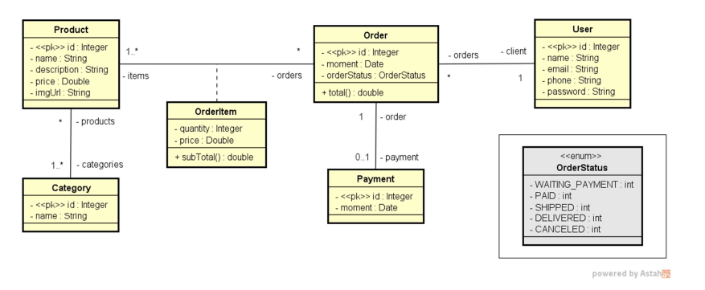

# Web-Service Pedidos 🛒

Este é um projeto de Web-Service para gerenciamento de pedidos, focado em operações CRUD completas. A aplicação segue os princípios da **Arquitetura em Camadas (3-Tier Architecture)**, garantindo uma separação clara entre a exposição da API, as regras de negócio e a persistência de dados.

## 🚀 Tecnologias Utilizadas

* **Java 17** & **Spring Boot**
* **JPA / Hibernate**: Para Mapeamento Objeto-Relacional e persistência.
* **MySQL**: Banco de dados relacional.
* **Postman**: Ferramenta de testes para requisições HTTP.

---

## 🏗️ Estrutura e Arquitetura

O projeto foi estruturado para solidificar conceitos de requisições HTTP e padrões de projeto. O fluxo de dados segue o modelo abaixo:

1.  **Controller**: Recebe as requisições (POST, GET, DELETE, PUT) e valida a entrada.
2.  **Service**: Processa a lógica de negócio e gerencia as transações.
3.  **Repository**: Interface que utiliza **JPA** para realizar queries no banco de dados de forma abstrata.
4.  **Database**: Persistência física dos dados em MySQL.

---

## 🛠️ Como Rodar o Projeto

1. **Pré-requisitos**: Possuir o JDK 17+ e o MySQL instalados.
2. **Clone o repositório**:

Ajuste as credenciais no arquivo src/main/resources/application.properties:

Properties:

spring.datasource.username=seu_usuario  
spring.datasource.password=sua_senha